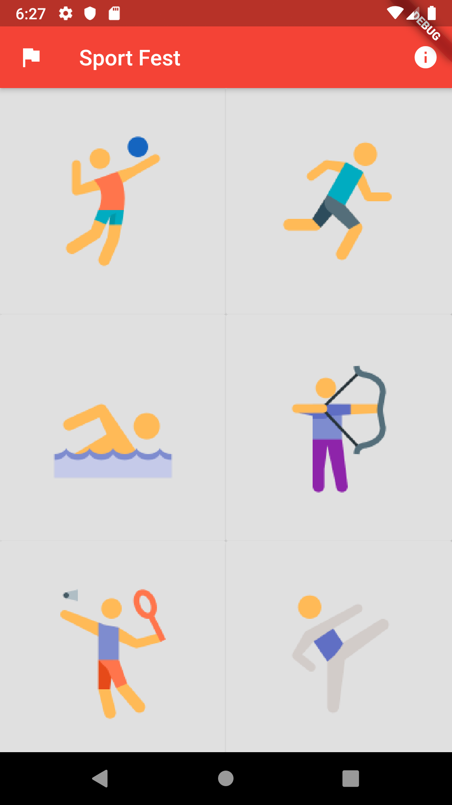

# Flutter Basic Apps (Tugas 3 - OSG08)
Aplikasi Flutter dengan tema Olahraga

## Screenshot

## Built With
- [Flutter](https://flutter.dev)

## Created By
M. Akbar Alfarisi

## {{jenis_kelas}} Eudeka!
{{tentang_kelas}}.

## {{nama_kelas}}
Dengan jangka waktu lebih kurang {{waktu_kelas}}, peserta diharapkan dapat {{tujuan_kelas}}.

## Cara Mendaftar {{jenis_kelas}}
{{cara_daftar}}.

## Info Lebih Lengkap
Website : [www.eudeka.id](https://www.eudeka.id).  
Twitter: [@EudekaID](https://twitter.com/EudekaID).  
Telegram : [@eudekainfo](https://t.me/eudekainfo).  
Instagram : [@eudeka.id](https://instagram.com/eudeka.id).  
WhatsApp : [0895351577557](https://wa.me/62895351577557).  
Email : [info@eudeka.id](mailto:info@eudeka.id).  

[kode_tugas]: Eudeka
[jenis_kelas]: Eudeka
[nama_kelas]: Eudeka
[tentang_kelas]: Eudeka
[waktu_kelas]: Eudeka
[tujuan_kelas]: Eudeka
[cara_daftar]: Eudeka
[kode_kelas]: Eudeka

###### tags: `Templates` `Eudeka`
